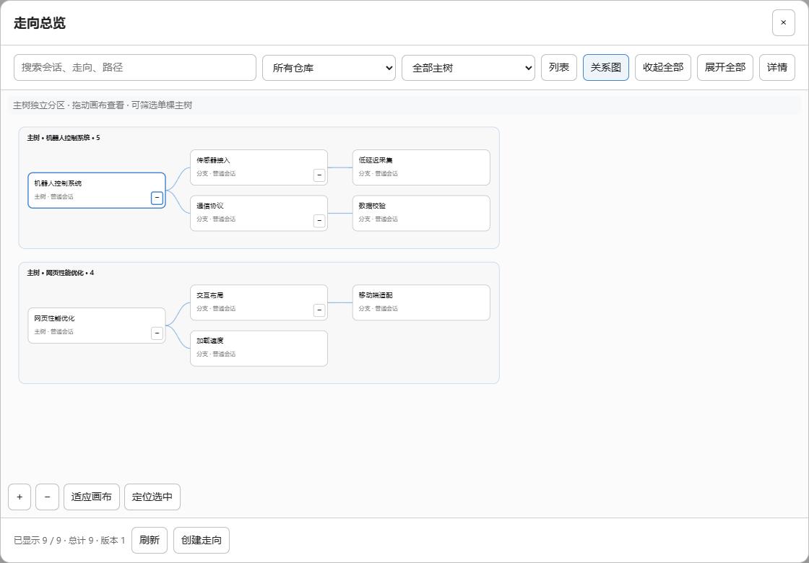

# dsh-branchman

> 给 DeepSeek Harness 的**树状工程走向**插件：一个动作 = 一条隔离工作区 + 一段继承历史的对话 + 树上的一条边。



*GUI 内的走向总览：主线是深色根节点，每条走向是一个方框，已合并=绿框、已拆除=灰虚线；可拖动平移、滚轮缩放、点方框看详情并切过去。*

---

## 它解决什么

模糊工程的真实工作流：对话进行到某个节点 → 想试另一条走向 → 走向要改代码。
于是要么两条走向在同一个目录里互相覆盖，要么整份克隆一份、从此与主线失同步。

DSH 和 git 各自已经有一半能力，缺的正是中间那一步：

| 已有的 | 缺的 |
|---|---|
| GUI 的分支按钮能分**对话** | 子会话工作目录没变，两条走向仍写同一堆文件 |
| `git worktree` 能分**工作区** | 跟对话没关系，得人肉两边操作，也没人记"谁从谁分出来" |

**dsh-branchman 把两者焊死**：分叉对话的时候工作区跟着走，目标树自己长出来、自己画出来。

## 用起来是什么样

在主对话里点任意一条回复尾部的 **`⎇ 分支到新走向`**，填一个走向名和一句话交接，然后：

```
① 建 .branches/<走向名> 的 git worktree，并开一条新分支
② 建子会话：工作目录绑到该 worktree，历史从父对话继承（不是空会话）
③ 交接语成为子会话的第一条上下文
④ 自动切到新会话
```

之后这条走向就是**独立工作区 + 独立对话**：主线照常演进，两边可以用 `branch_status` 看差多少、
用 `branch_merge` 合回主线、或 `branch_drop` 直接拆掉。

## 能力

**五个 agent 工具**（对话里直接说"开一条走向试 X"也行）：

| 工具 | 做什么 |
|---|---|
| `branch_fork` | worktree + 子会话 + 树边，一个原子动作 |
| `branch_tree` | 走向树 JSON（谁从谁分出来、状态、继承了多少事件） |
| `branch_status` | 各走向相对主线的 ahead / behind / 未提交改动 |
| `branch_merge` | 走向成果合回主线（要求主线干净，`--no-ff` 留痕） |
| `branch_drop` | 拆除走向：worktree + 分支 + 树节点 |

**界面**：每条回复尾部的分支按钮与总览入口，输入框旁的常驻总览按钮；
总览是 SVG 画的分支图，点方框可看详情、一键切到那条走向的会话。

**被动树投影**：工作目录落在 `.branches/` 下的会话会被自动收进树——不经过按钮开的走向也不会漏。
只记元数据，**消息正文永不进树**。

**零重启兜底**：`scripts/branchman.ps1` 是个纯 git 的 CLI（status/save/fork/list/sync/merge/drop），
插件没加载时也能手动开走向。

## 安装

```powershell
cd $env:DSH_HOME\profiles\desktop
pnpm add dsh-branchman
```

把 `"dsh-branchman"` 加进该 profile `package.json` 的 `dsh.profile.bundles`，然后
**完全退出 DSH（含托盘）再启动**——插件代码在宿主启动时加载，没有热重载。

> 想从源码装：`pnpm add github:mydsp/dsh-branchman`（加 `#v0.1.0` 可指定标签）。
> npm 上的包与仓库同源——0.1.0 的 tarball 校验和与仓库 `npm pack` 产物一致。

> 手动放置、本地开发、配置项与完整排障见 **[docs/INSTALL.md](docs/INSTALL.md)**。

## 设计要点

- **一个原子动作**：对话分叉与工作区分叉必须同时发生，否则"回到那一点换个方向"这件事本身不成立
- **历史继承走宿主自己的 fork 路径**：`observeSession` → 取**已完成回合前缀**当 boundary →
  `buildForkSeed` → `agents.create`。用"最后一个事件"当 boundary 会继承半截回合
- **树只存元数据**：节点主键是走向名 + 工作目录，`sessionId` 只作尽力关联（会话没了也不死卡）
- **写盘串行化 + 每次唯一临时名**：早期版本因此丢过一次 fork
- **失败必须说人话**：每种失败都明确告诉你"什么建好了、什么没成、接下来点哪里"

架构、数据形状与代码不变量见 **[docs/ARCHITECTURE.md](docs/ARCHITECTURE.md)**。

## 开发 DSH 插件必读

**[docs/PLUGIN-NOTES.md](docs/PLUGIN-NOTES.md)** 是 28 条**用真实报错换来的**宿主行为合同：
cordis 服务 Proxy 的抛错语义、`defineTool` 的必要性、`exports["./client"]` 为什么必须是字符串、
客户端会话目录为什么要在打开前 `refresh()`、写盘并发的 ENOENT、
以及"GUI 对外部浏览器完全关闭"这类只在踩坑后才知道的事实。
如果你也在写 DSH 插件，这份笔记能省掉大部分弯路。

## 测试

```powershell
npm test
```

**140 项断言 / 四个套件 / 不需要重启宿主 / 不碰你自己的仓库**：

| 套件 | 覆盖 |
|---|---|
| `test/tools.mjs` | 五个工具全链路、脏线守卫、24 次并发写不变量 |
| `test/seeded.mjs` | 子会话继承历史、agent preset 挂载、boundary 算法 |
| `test/client.mjs` | 桩 DOM/React/fetch，真实点击按钮走完整链路 + 总览图渲染与交互 |
| `test/manifest.mjs` | 宿主 manifest 校验规则预检（防"加载失败 → 整包被回滚"） |

零依赖，不需要 `npm install`。CI 在 ubuntu + node 22/24 上跑同一套（未装 DSH 时，
一条依赖宿主安装的断言报 `SKIP` 而不是 `FAIL`）。

## 兼容性

- 实测：DSH Desktop 2.0.14 / Harness 0.1.7-rc.1
- 宿主未提供 `sessionQuery` / `agents` 时自动降级为"空子会话"，并明确告知（不会假装继承了历史）
- 需要 git ≥ 2.28

## 已知限制

- 走向名同时是目录名与分支名（≤ 60 字符）
- fork / merge 要求主线工作区干净——守卫是故意的，否则会把无关改动卷进走向或合并里
- 只有在源对话存在**已完成回合**时才能继承历史；否则降级为空子会话（宿主自己的 fork 在这种情况下直接拒绝）
- 总览图目前是只读的：merge / drop 走工具或脚本

## 许可

[MIT](LICENSE) © 2026 mydsp
