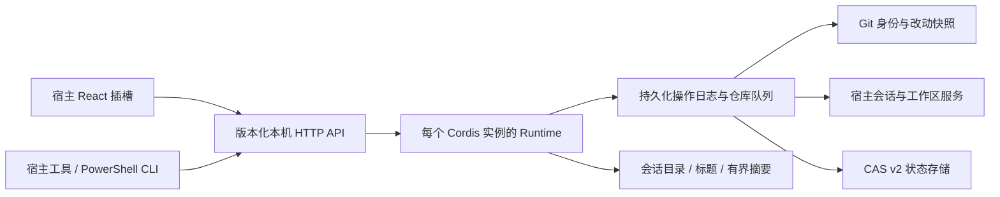

# 当前实现架构（0.3.0）

## 数据流

## 入口与边界

`scripts/build.mjs` 把宿主 Runtime 构建为根 `index.js`，把 UI 构建为根 `client.js`。客户端使用宿主 ModuleLoader 和 React，不使用 eval、动态 Function 或 innerHTML。纯模块测试通过不等于宿主装配通过，真实桌面记录另列。

每个实例拥有自己的可选服务、缓存与生命周期。服务替换或卸载时，旧异步结果不能跨代写入。观察租约在所有退出路径通过 `Symbol.dispose` 释放。

## 身份与状态

- Repository：UUID 与 Git common-dir；linked worktree 共享仓库身份。
- Worktree：UUID、精确路径、预期分支、外部/插件所有权。
- Direction：UUID、显示名称、工作树、父集成目标、主会话、已知 baseOid 与交接说明。
- SessionLink：会话与工作树关联；live、persisted、missing、unknown 独立区分。
- ForkEdge：源/目标会话、真实继承边界与操作 ID。旧版本未知字段保留 null。

`StateStore` 串行执行 CAS 检查、磁盘写入和内存替换；快照深冻结。临时文件 fsync 后 rename，写失败不会推进内存版本。

v1 迁移单独生成 `tree-v2.json` 和报告，保留旧文件、已移除走向、摘要、工作区与时间戳。未知 baseOid 不推测。悬空父节点、环与缺失身份进入恢复状态；父走向解析限定同一仓库。

## 分叉事务

先确认源 cwd、真实 Git 身份和会话完成边界；操作 ID、资源 UUID 与计划先落盘。随后按阶段捕获改动、创建工作树、携带文件、创建确定 ID 子会话、注册工作区、提交方向状态。

每个仓库串行，同 requestId 与同参数共享终态，参数改变报冲突。Git、宿主会话与 JSON 文件不能形成单个 ACID 事务，因此状态明确区分 succeeded、failed 和 recovery-required。宿主创建结果不确定或后续阶段失败时保留资源，以实际 Git 注册、子会话持久化与日志对账恢复。

改动快照保存 Git binary diff 和实际文件字节并校验源在捕获期间未变化；恢复标记校验目标 HEAD、status、diff 与各文件摘要，防止把用户后续改动当成已携带内容。

## 集成与移除

合入/同步前同时检查源与目标精确路径、common-dir、预期分支和干净状态；实际冲突保留现场，不自动 reset 或 abort。移除只允许插件拥有、干净且没有未合入提交的工作树；不使用 force。

## 读取与客户端

目录查询独立于方向表，普通会话不会隐藏。单次标题批量最多 64 项，空/失败结果退避；缺失摘要单次最多观察 2 个会话，不写状态。未知子目录不按字符串前缀猜仓库，等待 Git 身份确认。

客户端每页 80 行，图形只布局已显示节点；环不会清空节点。相机状态与数据刷新分离；可见面板每 5 秒刷新，关闭时取消请求。焦点、键盘、主题与语言由实际宿主验证。

## 发布

真实 npm tar 作为唯一安装来源。隔离 pnpm 安装、校验实际字节，再整组替换 profile 的 node_modules、manifest 和 lock/patch；阶段与备份校验落盘。安装成功仍是 pending-validation。代码回滚保留兼容 v2 数据，未知旧 schema 不允许覆盖新写入数据。
